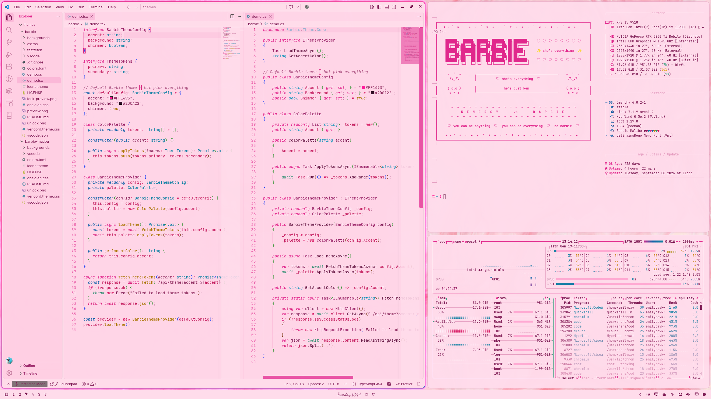
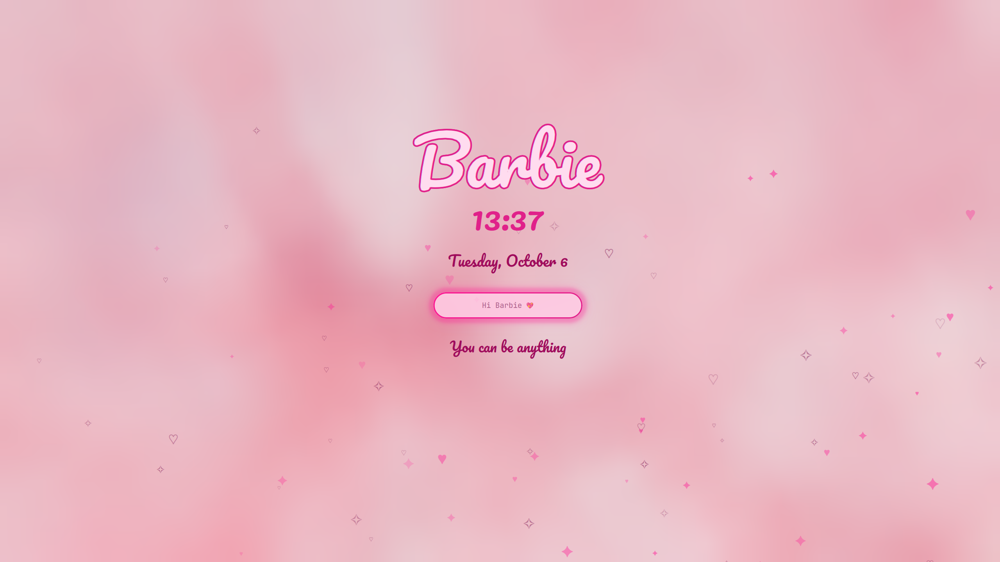

# Omarchy Barbie Malibu Theme

A light, daytime companion to the [Omarchy Barbie theme](https://github.com/BBIEPavkov/omarchy-barbie-theme) for [Omarchy](https://omarchy.org/): pastel pink backgrounds, deep berry text, hot pink accents, and ocean blue and sunshine yellow highlights. Includes matching VS Code, Obsidian, and Discord themes.



## Install

```bash
omarchy theme install https://github.com/BBIEPavkov/omarchy-barbie-malibu-theme
omarchy theme set barbie-malibu
```

Requires Omarchy 4 (Quattro) and the `Yaru-magenta` icon theme.

## Dark Mode

For nighttime, use the dark [Omarchy Barbie theme](https://github.com/BBIEPavkov/omarchy-barbie-theme): deep violet-pink backgrounds with hot pink accents.

```bash
omarchy theme install https://github.com/BBIEPavkov/omarchy-barbie-theme
omarchy theme set barbie
```

Switch between the two any time with `omarchy theme set barbie` and `omarchy theme set barbie-malibu`.

## Colors

| Role | Color |
|------|-------|
| Background | `#FFDCEB` (pastel pink) |
| Foreground | `#7A1550` (deep berry) |
| Accent | `#E0218A` (Barbie pink) |
| Blue | `#0B5FA8` (ocean blue) |
| Yellow | `#C98A00` (sunshine yellow) |

## VS Code

A matching light VS Code theme is in the `vscode/` folder. Link it into VS Code:

```bash
ln -s ~/.config/omarchy/themes/barbie-malibu/vscode ~/.vscode/extensions/omarchy-barbie-malibu-theme
```

Reload VS Code, then pick **Omarchy Barbie Malibu** from the theme picker (`Ctrl + Shift + P` → Preferences: Color Theme).

## Obsidian

Omarchy themes Obsidian automatically. This theme adds heart bullet points, a heart before each top-level heading, pink highlights, and dividers made of hearts.

## Discord

For [Vencord](https://vencord.dev) or Vesktop, with Discord set to its light appearance: copy `vencord.theme.css` into Vencord's themes folder, then turn it on under Settings → Themes.

```bash
cp ~/.config/omarchy/themes/barbie-malibu/vencord.theme.css ~/.config/Vencord/themes/barbie-malibu.theme.css
```

## Extras

The Barbie lock screen, heart bar, heart popups, pink cursor, and the rest come from the [Omarchy Barbie theme](https://github.com/BBIEPavkov/omarchy-barbie-theme)'s extras. Install that theme, run its `extras/install.sh`, then switch back to Malibu. The extras take their colors from whichever theme is active.



## Wallpapers

Cycle through them with `Super + Ctrl + Space` or `omarchy theme bg next`. Add your own to `~/.config/omarchy/backgrounds/barbie-malibu/`; that folder survives theme updates.

Photos from [Unsplash](https://unsplash.com), free to use under the [Unsplash License](https://unsplash.com/license):

| File | Photographer |
|------|--------------|
| `pink-blossoms.jpg` | [Mi Min](https://unsplash.com/photos/pkpqoBp11Jc) |
| `pink-building-palms.jpg` | [Caroline Ross](https://unsplash.com/photos/qkZbgZ9dM8c) |
| `pink-clouds.jpg` | [Xinyi Wen](https://unsplash.com/photos/qjCHPZbeXCQ) |
| `pink-paint-swirl.jpg` | [Pawel Czerwinski](https://unsplash.com/photos/6Oyd_q79z2M) |
| `pink-peach-gradient.jpg` | [Ikhlas](https://unsplash.com/photos/MzfOPW5Tb3M) |
| `pink-sky-bridge.jpg` | [Anders Jildén](https://unsplash.com/photos/AkUR27wtaxs) |

## Disclaimer

Barbie is a trademark of Mattel, Inc. This is an unofficial fan theme and is not affiliated with or endorsed by Mattel.
